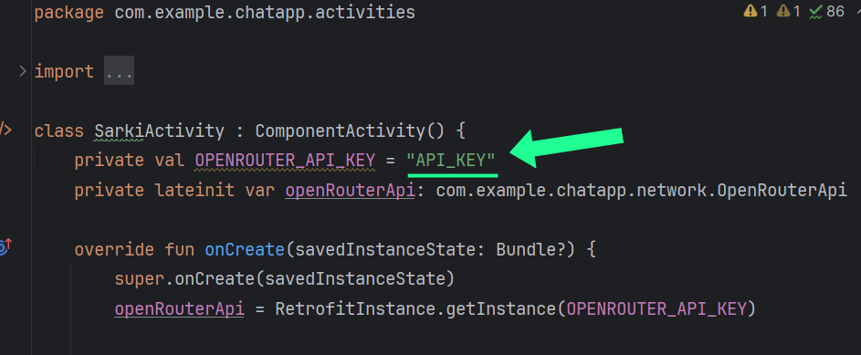
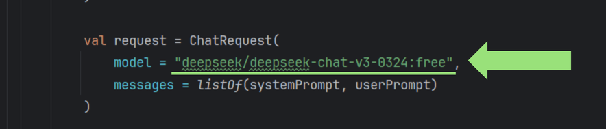

# ZippyVerse
ZippyVerse, ebeveynler ve çocukları için eğlenceli etkinlik fikirleri sunan bir uygulamadır.

## Kurulum
Öncelikle, uygulamayı çalıştırmak için Android Studio veya benzeri bir editörde kurulumu tamamlamalı ve [OpenRouter.ai](https://openrouter.ai/) web sitesinden bir API anahtarı almalısınız. API anahtarı almak için ücretsiz bir hesap 
oluşturmalısınız (Google hesabınızla da kayıt olabilirsiniz). 

Ardından kod dosyalarınız içinde yer alan *AcikHavaActivity.kt*, *EtkinlikActivity.kt*, *OyunActivity.kt*, *SarkiActivity.kt*, *VideoActivity.kt* ve *MainActivity.kt* dosyalarında "API_KEY" olarak tanımlanan 
değişkenlere keyinizi string olarak yapıştırın. (keyiniz genelde "*sk*" ile başlar.)

*Görsel 1*

Bu noktada emülatörü çalıştırdığınızda uygulama çalışacaktır.

# Ek Bilgiler & Düzenleme
Kodlar yazılırken ücretsiz bir model olan "*deepseek-chat-v3-0324:free*" modeli kullanıldı, bu modelin dokümanlarına [buradan](https://openrouter.ai/deepseek/deepseek-chat-v3-0324:free) ulaşabilirsiniz.

Openrouter.ai üzerinden erişebileceğiniz birçok ücretli ve ücretsiz model bulunuyor, tüm modellerin listesine [buradan](https://openrouter.ai/models) ulaşabilirsiniz. 

Eğer kodlar üzerinde değişiklik yaparak modeli değiştirmek isterseniz; bunun için *AcikHavaActivity.kt*, *EtkinlikActivity.kt*, *OyunActivity.kt*, *SarkiActivity.kt*, *VideoActivity.kt* ve *MainActivity.kt* 
dosyalarının içinde yer alan "model" değişkenini ilgili modelin dokümanında yer alan kod satırı ile değiştirmeniz yeterli olacaktır. (*Görsel 2*'de gösterilmiştir.)

Ancak bu uygulama yazılırken "*deepseek-chat-v3-0324:free*" modeli kullanıldığı için çeşitli düzenlemeler yapmanız gerekebilir.

*Görsel 2*
